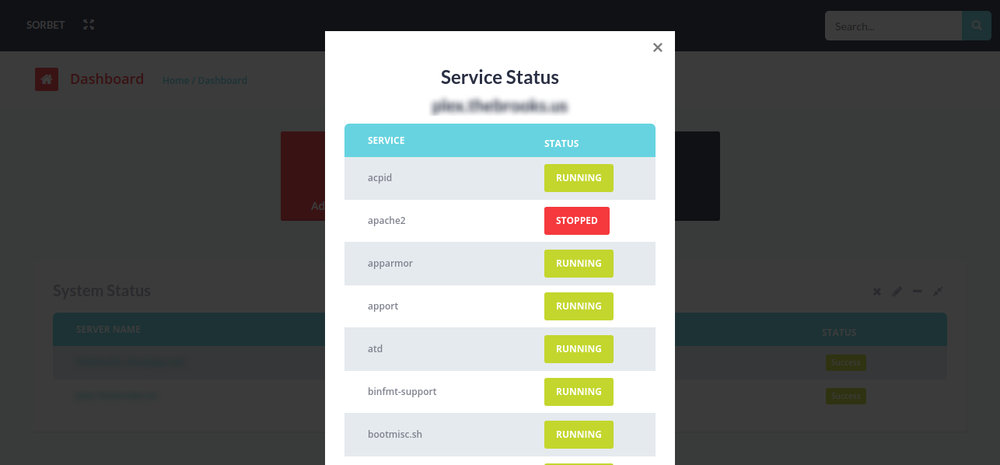

<p align="center">
    
</p>

Sorbet
======================

[](https://nodei.co/npm/sorbet/)

A light, simple, and delicious infrastructure monitoring solution.


#### How to install
```bash
$ [sudo] npm install -g bower gulp
```

#### How to run
```bash
$ [sudo] sorbet start
```

Navigate to http://localhost:6767

#### Getting Help
```bash
$ [sudo] sorbet --help
```


#### Screenshots



